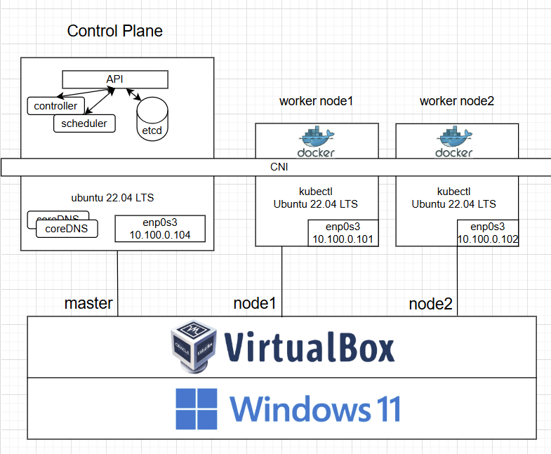

# 자동확장과 로드밸런싱을 활용한 게임 서버 관리 시스템

본 프로젝트는 Kubernetes 환경에서 Minecraft 게임 서버를 자동으로 확장하고, 트래픽을 분산 처리하여 서버 과부하 문제를 해결하는 시스템을 구현한 졸업 작품입니다.

---

## 프로젝트 목표

- 트래픽 증가 시 서버 과부하 현상 완화
- Kubernetes HPA를 통한 게임 서버 자동 확장
- 로드밸런서(Service)를 이용한 유저 트래픽 분산
- 실시간 대시보드를 통한 서버 상태 시각화

---

## 시스템 아키텍처

- VirtualBox에 Ubuntu VM 3대 구성 (kubeadm으로 클러스터 구축)
  - master 1대 + worker 2대
- Minecraft 서버를 Kubernetes Deployment로 배포
- CPU 부하 기반 HPA 구성
- LoadBalancer Service를 통한 외부 연결
- Prometheus + Grafana로 실시간 모니터링
- 봇 (bot.js)으로 트래픽 시뮬레이션

---

## 실행 시나리오

1. **기본 상태**  
   - Minecraft 서버 1개만 실행됨 (Pod 1개)  
   - CPU 사용률 안정적

2. **트래픽 증가**  
   - 봇 접속 부하 유도  
   - CPU 사용률 상승 → HPA 감지

3. **자동 확장**  
   - Pod가 1개 → 2개 이상으로 자동 증가  
   - 로드밸런서가 트래픽 분산

4. **서버 안정화**  
   - CPU 사용률 분산  
   - Grafana에서 Pod 수 및 CPU 사용률 확인 가능
     
5. **부하 종료 → Pod 축소**  
   - CPU 사용률 하락  
   - 자동으로 Pod 수 축소

---

## 팀원 기여도

본 프로젝트는 전 과정을 두 명이 함께 협업하여 진행한 공동 작업물입니다. 

- Kubernetes 클러스터 구성
- Minecraft 서버 배포 및 자동 확장(HPA) 설정
- 트래픽 시뮬레이션 봇 제작 및 부하 테스트
- Docker 및 컨테이너 환경 구성
- Prometheus + Grafana 모니터링 시스템 구축
- 시나리오 설계, 시연 영상 제작, 증빙자료 구성

- 아래는 각 팀원이 상대적으로 더 중심을 두고 맡았던 부분입니다.

### 길도희
- Kubernetes 클러스터(kubeadm) 구성 및 시스템 아키텍처 설계
- Grafana + Prometheus 기반 모니터링 환경 구축
  

### 최다연
- Minecraft 봇(`bot.js`) 제작 및 자동 접속 기능 구현
- 트래픽 시나리오 설계 및 부하 테스트 자동화
- Dockerfile 작성 및 컨테이너화
- 시연 영상 제작 및 증빙자료 정리
  
---

## 주요 기술 스택

- Kubernetes (kubeadm, minikube)
- Docker
- HPA (Horizontal Pod Autoscaler)
- Prometheus + Grafana
- Node.js (Minecraft 봇)

---

## 결론

- 본 시스템은 실제 유저 트래픽 시나리오를 기반으로 자동확장과 부하분산의 효과를 직접 확인할 수 있도록 구성되었습니다.
- Kubernetes의 자원 관리 기능을 활용한 실시간 대응 구조를 시각적으로 보여주는 데 초점을 맞추었습니다.

